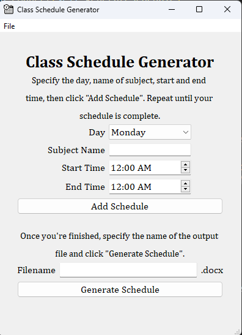
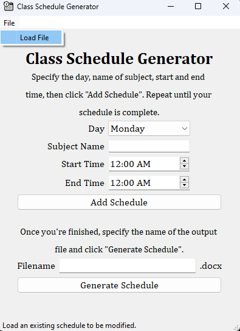

# Class-Schedule-Generator
#### Video Demo:  <URL HERE>
## Description
This project serves as my final project for CS50x. It generates a class schedule for you in a Word file. The project was made with Python and QT library (PyQT6). 
The GUI was made with the help of QT Designer. 

## Background
I decided to create this project because I wanted something practical; something I could use throughout my college life. At first, my plan was to create a student utility
tool consisting of a to-do list and a schedule generator, then I realized that it's hard for me to do that because I struggled in using QT Designer, so I decided to start 
small for now. I went on to create this Class Schedule Generator instead. 

## Usage
### Running the Program
When running the program for the first time, make sure to execute *installRequirements.py* first to install the necessary modules in order to run the program (Make sure you have Python of version 3.10 or above
installed). Execute *mainGUI.py* afterwards.

Running the program again only requires you to execute *mainGUI.py*.

### Using the program
Enter the appropriate information in the form (day of the schedule, name of subject, start and end time), then click *Add Schedule*. Repeat this process until all of your schedules have been added.
Once finished, specify the name of the output file (anything but **template**) and click *Generate Schedule* and it will generate a Word file containing your schedule formatted automatically and 
sorted according to *start time*. 

By default, this program modifies *template.docx*, but you can modify existing schedules created by the program by clicking **File>Load File** at the top left.

### template.docx
TODO

## More information on the creation of this program
TODO
