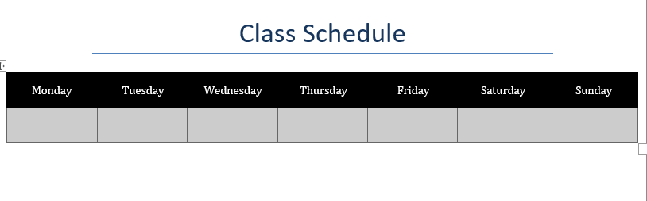
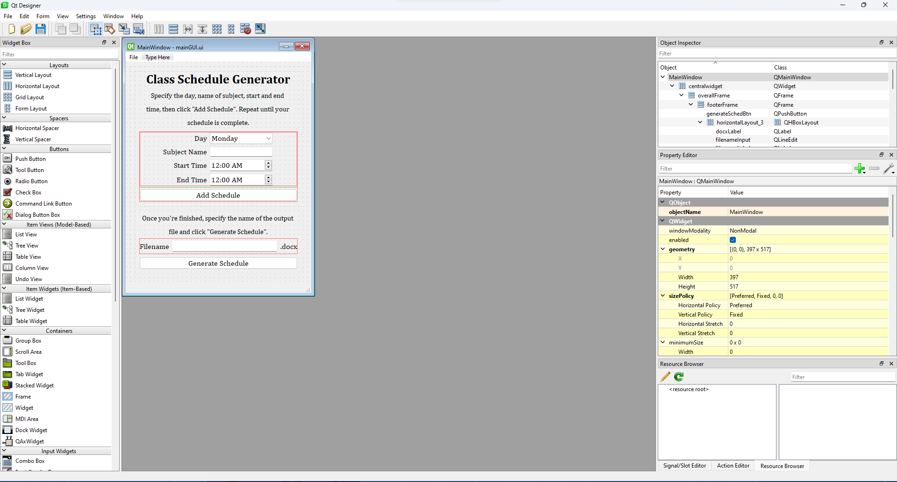

# Class-Schedule-Generator
#### Video Demo:  <URL HERE>
## Description
This project serves as my final project for CS50x. It generates a class schedule for you in a Word file. The project was made with Python and QT library (PyQT6). The GUI was made with the help of QT Designer. Inspired by Tech With Tim's [Schedule-Creator](https://github.com/techwithtim/Schedule-Creator).


## Background
I decided to create this project because I wanted something practical; something I could use throughout my college life. At first, my plan was to create a student utility
tool consisting of a to-do list and a schedule generator, then I realized that it's hard for me to do that because I struggled in using QT Designer, so I decided to start 
small for now. I went on to create this Class Schedule Generator instead. 

## Usage
### Running the Program
When running the program for the first time, make sure to execute *installRequirements.py* first to install the necessary modules in order to run the program (Make sure you have Python of version 3.10 or above
installed). Execute *mainGUI.py* afterwards.

Running the program again only requires you to execute *mainGUI.py*.

### Using the program
Enter the appropriate information in the form (day of the schedule, name of subject, start and end time), then click *Add Schedule*. Repeat this process until all of your schedules have been added.
Once finished, specify the name of the output file (anything but **template**) and click *Generate Schedule* and it will generate a Word file containing your schedule formatted automatically and 
sorted according to *start time*. 

By default, this program modifies *template.docx*, but you can modify existing schedules created by the program by clicking **File>Load File** at the top left.


### template.docx
You can customize *template.docx* to your liking. It looks like this by default:




## More information on the creation of this program
The program isn't too complex *per se*, it only took me around 4 days to complete with 2-4 hours allocated per day in creating the project. It just takes user input and places the data to a Word table with the help of Python-docx. The Python-docx wasn't too difficult to use because the documentation is well-written in my opinion (Fun Fact: I used the demo code found in the documentation to generate the header). The hardest part in this journey was learning all about Qt6.

The documentation of Qt is so vast because it covers other things aside from creating a GUI. It's hard for me to rely on documentation only so I resorted to watching tutorials on YouTube. Good thing **Tech With Tim** created a tutorial series on making a GUI using PyQt5 (most, if not all of it still applies on PyQt6). I learned so much from the series and made creating this program much easier. 

### mainGUI.py
If you'd take a look at the source code of *mainGUI.py*, you could probably tell that the code was automatically generated (lines 1-6 made it obvious). It's all thanks to **Qt Designer**, an app where you can create graphical user interfaces by dragging and dropping. Basically, what you see is what you get, instead of relying on trial-and-error if you manually code the GUI.



What's nice about Qt Designer is that it allows you to visualize the containers, like those red outlines inside the main window. It makes arranging the widgets so much easier because the container arranges them automatically. You can also see the hierarchy of objects as well as their properties on the right side.

*mainGUI.py* is also the largest file in this project, consisting of 316 lines. Most of it is automatically generated though. I did modify it to provide functionality to the buttons, generate popups, and submit data to *scheduleOperations.py*, which is the main program for putting data in the Word table and sorting them accordingly.

### scheduleOperations.py
This file is responsible for the operations in creating the schedule (adding the schedule to a list, sorting the schedule, and generating the finished schedule).
```
insert_sched(day: str, subject: str, start_time: str, end_time: str, document) -> int
```
This function is responsible for the adding the schedule to a list. It returns an integer representing the status code that tells if the insertion was a success or fail (0 - success, 1 -  fail).

```
sortSched(schedList: list)
```
This function is responsible for sorting the schedule (if it wasn't obvious already by its name). It sorts by the **start time** in ascending order.

```
generate_sched(saveFileName: str, loadFileName: str) -> int
```
This function generates the schedule into a Word file, and the output file name is specified in the saveFileName parameter.

### installRequirements.py
This file, when executed, installs the requirements specified in *requirements.txt*. 

Basically, it executes these commands:
```
pip3 install python-docx
pip3 install pyqt6
```
It is crucial to run this file first when running Class Schedule Generator for the first time since it installs the required modules used in the program. Without those modules, the program wouldn't run.

### The *backup* Folder
This folder contains a copy of *template.docx*, just in case something goes wrong with the template file in the *Schedules* folder, or if a user accidentally deletes the file.